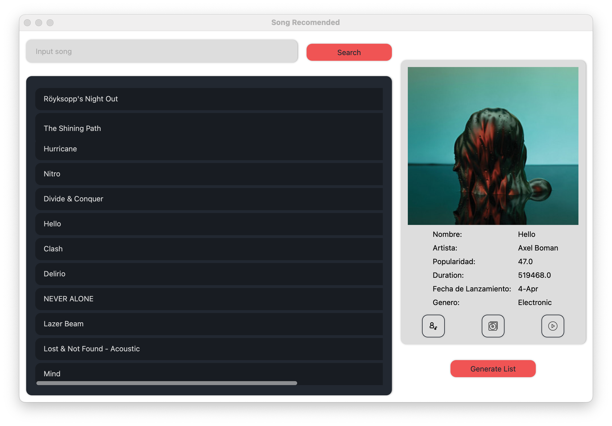

# Prim-Spotify


Este proyeco realiza el algoritmo Prim en un dataset de Spotify

Dataset : [Keagle](https://www.kaggle.com/datasets/javivaleiras/spotify-tracks-19202020)


## Instalacion
### Librerias
Las librerias que se usan son las siguientes :
```python
networkx
PyQt6
spotipy
```
Para poder instalar
```bash
pip3 install <libreria>
```
